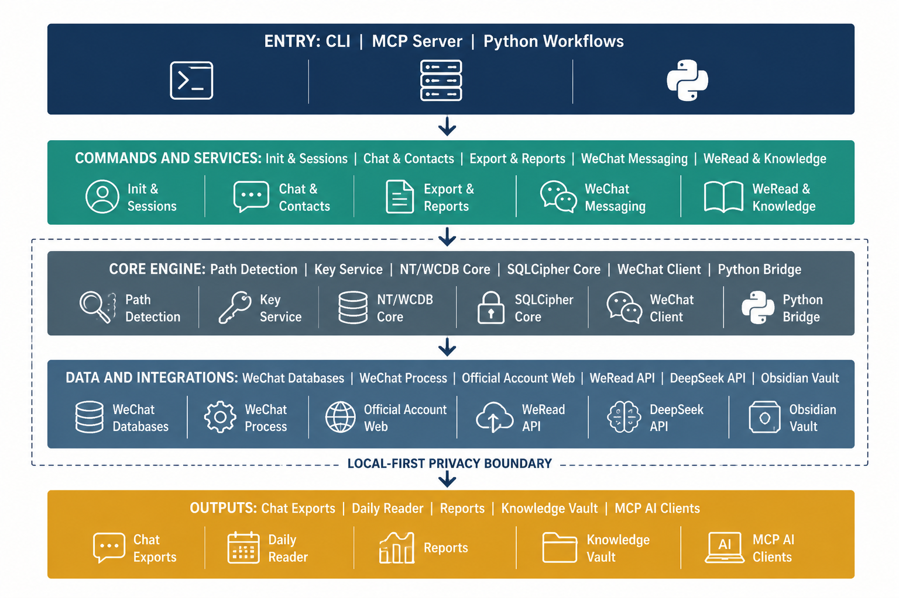

<div align="center">

<h1>𝗪𝗲𝗙𝗹𝗼𝘄 𝗖𝗟𝗜 </h1>

[简体中文](./README.md) · **English**

*"People today have never seen the moon of ancient times, yet today's moon once shone upon the people of old." — Li Bai*

> *"Heaven and earth are the inn of all things; time, a passing traveler through a hundred generations." — Li Bai*

> Bring your chat history, official-account reading, and personal knowledge workflows back to your own computer.

[](https://www.npmjs.com/package/weflow-cli)
[](https://nodejs.org/)
[](https://www.python.org/)
[](https://github.com/zhuobichen/weflow-cli/releases)
[](./SECURITY.md)
[](./LICENSE)

</div>

**WeFlow CLI turns WeChat into your local second brain**: decrypt and query chat history with one command, export readable HTML; turn official-account articles into AI-digested daily reports; read your WeChat favorites; build a semantic-searchable knowledge base — and plug it all into MCP-compatible AI editors like Claude Code. Works on Windows and Linux.

> 🔒 **Local-first**: runs entirely on your machine — zero telemetry, zero cloud reporting. Database keys are stored locally, encrypted with machine-bound AES-256-GCM. AI features only activate after you explicitly configure your own API key. See the [Security & Privacy statement](./SECURITY.md).

> This project is intended only for data you are authorized to access. Please obey applicable laws, WeChat's terms, and the privacy of others.

## At a Glance

**WeChat favorites query** (real data, locally decrypted `favorite.db`, with type filter and keyword search):

```text
$ weflow-cli fav list -n 3

收藏列表 (共 1042 条, 显示 3 条):

[2026/8/21 19:42:42] [文章] “豆包型人格”爆火，可千万别学
    来源: 中国研究生
    https://mp.weixin.qq.com/s/eDk_kcyd8ltuqn6J3iReVg
[2026/8/21 10:50:38] [文章] 爆火插件让DeepSeek V4 Pro 0813性能拉满，全面超越 Fable 5！
    来源: 智猩猩AI
    https://mp.weixin.qq.com/s/3GXFjmtUsq42sXJHJGgwyg
[2026/8/21 10:47:21] [文章] 250年前，一个26岁年轻人写了一本小册子，至今仍在拷问每一个文明社会
    来源: 悦读撷英
    https://mp.weixin.qq.com/s/YIkB8TyyyimPP1hmgQQPZg
```

**The full workflow, one command per step**:

```text
weflow-cli sessions                    # list chat sessions
weflow-cli messages "contact" -n 20    # query chat messages
weflow-cli export "contact" html       # export HTML / Excel / Markdown / JSON
weflow-cli fav list -t article -k AI   # favorites: type filter + keyword search
weflow-cli daily --date 2026-08-21     # official-account digest + AI summary
weflow-cli daily-server                # local reader http://localhost:8765
weflow-cli chat "How does RAG work?"   # knowledge-base RAG Q&A
weflow-cli mcp-config                  # one-shot MCP client integration
```

## What You Can Do

| Scenario | Capability |
| --- | --- |
| Chat history | Query sessions, contacts, and messages; export to JSON, TXT, Markdown, HTML, Excel. |
| Official-account digest | Crawl articles, AI summarization and classification, generate a local reading page, keep favorites and read states. |
| Personal knowledge base | Sync WeRead notes, build an Obsidian vault, semantic search, RAG Q&A, and a concept wiki. |
| AI collaboration | Expose article crawling, knowledge-base retrieval, digests, and local chat data (sessions/favorites/Moments/todos) to MCP-compatible clients — 22 tools sharing the same layer as the WeChat bot. |
| Personal review | Monthly chat reports, annual reports, todo extraction, and local Moments cache queries. |
| WeChat favorites | Read WeChat "Favorites" (official-account articles, text, images, videos, chat records) with type filters, keyword search, and Markdown/JSON export. |
| Second-brain agent | Chat with a local AI assistant inside WeChat: natural-language queries over chats, favorites, Moments, digests, WeRead, todos, and the knowledge base; three-tier memory across sessions, daemonized background service. |

> **⚠️ Intended use**: this tool only accesses data of **your own** WeChat account, on your own machine, with your own consent. Using it to monitor a partner, employee, or any third party without their informed consent — or deploying it onto someone else's device or running it remotely and silently — is illegal and has nothing to do with this project. See [SECURITY.md](SECURITY.md).

## Quick Start in Three Minutes

### 1. Install and Check

Requires Node.js 18+, Python 3.10+, and a signed-in Windows WeChat. After installation, check your environment first:

```powershell
npm install -g weflow-cli
weflow-cli check
```

Install the Python dependencies required by the standard Windows 4.x workflow:

```powershell
python -m pip install -r requirements.txt
```

If you are still on WeChat 3.x, also install the optional dependencies: `python -m pip install -r requirements-3x.txt`.

### 2. Initialize Local Data Access

Close WeChat and run the initialization. Follow the prompts to start and sign in to WeChat; the CLI will try to discover the data directory and extract the required keys:

```powershell
weflow-cli init
```

The WeChat "storage location", account directory, and its `db_storage` directory can all be specified directly:

```powershell
weflow-cli init --path "D:\WeChat\xwechat_files"
```

Once initialization finishes, verify that your own data is readable:

```powershell
weflow-cli sessions
weflow-cli contacts -k "keyword"
weflow-cli messages "contact" -n 10
```

For key, database, or Python environment issues, follow the [Operations & Troubleshooting Guide](./OPERATIONS.md) step by step.

### 3. Pick a Workflow

**Export a chat history**

```powershell
weflow-cli export "contact" html --output ./output
```

**Generate the official-account digest for a day**

```powershell
weflow-cli daily --date 2026-08-12 --api-key "Your DeepSeek API Key"
weflow-cli daily-server --date 2026-08-12
```

The reader serves at `http://localhost:8765/` by default.

**Connect an AI editor**

```powershell
weflow-cli mcp-config > .mcp.json
```

Place the generated configuration wherever your MCP client expects it and restart the client. See `weflow-cli mcp-config` output for the tool list and configuration details.

Beyond the knowledge-base tools, the MCP server also exposes the full local WeChat data layer (sessions, chat history, favorite-article bodies, Moments, digests, WeRead, todos, knowledge base, and assistant memory) — 22 tools in total, sharing the same tool layer and long-term memory as the WeChat bot. See the [MCP Integration Guide](./docs/MCP.md) for the tool inventory and security boundaries.

**Host a local AI assistant in WeChat (second brain)**

```powershell
weflow-cli config set deepseekApiKey "sk-..."   # or any OpenAI-compatible endpoint: aiBaseUrl + aiModel
weflow-cli login-wechat        # scan the QR code to bind the messaging channel (a ClawBot contact appears in WeChat)
weflow-cli assistant start     # run the agent as a background daemon
```

Then just talk to ClawBot on your phone. The assistant queries local chats and favorites to answer, with memory that survives across sessions:

- "What have I been busy with lately?" — synthesizes recent sessions and messages
- "Summarize my chats with XX" — pulls that thread's history
- "Which AI articles do I have in favorites?" — searches WeChat favorites
- "What does this favorited article say?" — fetches and summarizes the article body
- "What's new on my Moments?" / "Who posts the most?" — Moments timeline and stats
- "What did official accounts push today? Any AI ones?" — digest queries with topic/keyword filters
- "What am I reading?" / "My notes on XX" — WeRead shelf and notebooks
- "Any pending todos? Anything urgent?" — todo list sorted by urgency
- "How does my knowledge base explain RAG?" — concept-wiki lookup
- "Remember: my project is called weflow-cli" — writes to long-term memory

How it works: the daemon long-polls WeChat's official bot channel (iLink); the agent loop, three-tier memory (working window / rolling summary / long-term facts), and all database queries run on your machine. Only the final question and reply texts go to the configured LLM; phone numbers, emails, and links in tool output are redacted by default (`config set assistantPrivacy strict` for stronger masking; a local `ollama` engine keeps everything offline). Sessions expire after 24h of inactivity, and proactive replies per window are capped by official limits.

Cost guardrails: a built-in daily cap of 100 processed messages (send "记忆" in WeChat to check usage), plus an optional whitelist so only you can trigger AI calls:

```powershell
weflow-cli config set assistantWhitelist "your-@im.wechat-ID"   # empty = allow everyone
```

Management: `weflow-cli assistant status` / `log` / `stop`; send "帮助" in WeChat for in-chat commands.

## Common Commands

| Goal | Command |
| --- | --- |
| Check environment & config | `weflow-cli check` · `weflow-cli config show` |
| Initialize or specify paths | `weflow-cli init [--path <dir>]` |
| Browse chat data | `weflow-cli sessions` · `weflow-cli messages <contact>` · `weflow-cli contacts` |
| Export chat history | `weflow-cli export <contact> <json\|txt\|md\|html\|excel>` |
| Digest & reader | `weflow-cli daily` · `weflow-cli daily-server` · `weflow-cli review` |
| Moments cache | `weflow-cli sns timeline` · `weflow-cli sns users` · `weflow-cli sns stats` |
| WeChat favorites | `weflow-cli fav list` · `weflow-cli fav export markdown` · `weflow-cli fav set-key` |
| WeRead | `weflow-cli weread shelf` · `notes` · `search` · `stats` |
| Knowledge base | `weflow-cli vault` · `weflow-cli wiki` · `weflow-cli search <query>` · `weflow-cli chat` |
| Reports & tasks | `weflow-cli report` · `annual-report` · `todos` |
| Second-brain assistant | `weflow-cli assistant start` · `status` · `log` · `stop` |
| AI editor integration | `weflow-cli mcp-config` |

Run `weflow-cli <command> --help` for the full options of any command. For example:

```powershell
weflow-cli export --help
weflow-cli daily --help
```

## Running from Source

```powershell
git clone https://github.com/zhuobichen/weflow-cli.git
cd weflow-cli
npm install
npm run build
npm run dev -- check
npm run dev -- init
```

Main Python workflows:

```powershell
# Article crawling -> AI classification -> HTML reading page -> Wiki / learning digest
python scripts/pipeline.py --date YYYY-MM-DD --api-key "Your API Key" --engine deepseek

# Run step by step
python scripts/biz_daily.py --date YYYY-MM-DD --api-key "Your API Key"
python scripts/generate_html.py --date YYYY-MM-DD
python scripts/fav_server.py --date YYYY-MM-DD
```

## Architecture



The project is split into four clearly bounded parts:

| Directory | Responsibility |
| --- | --- |
| `bin/` | Commander CLI entry and interactive flows. |
| `src/core/` | WeChat data directory discovery, keys, NT/WCDB/SQLCipher database access. |
| `src/services/` | Chat, contacts, export, config, message channel, and other business capabilities. |
| `scripts/` | Python workflows: official-account digest, reader, knowledge pipelines, reports, search. |
| `mcp-server/` | stdio server for MCP clients. |

For a more complete view of modules and data flow, read [ARCHITECTURE.md](./ARCHITECTURE.md).

## Privacy & Security

- Databases, key configuration, and exported files stay on your machine by default; key fields are stored machine-bound and encrypted.
- Network requests involving DeepSeek, article crawling, WeRead, or MCP happen only when you run the corresponding workflow.
- Use `whitelist`, `blacklist`, and `audit` to manage or audit message sending; always confirm the target contact and content before sending.
- After upgrading WeChat, switching accounts, or migrating computers, you may need to re-initialize or re-scan NT keys.

## Documentation & Feedback

- [Operations & Troubleshooting Guide](./OPERATIONS.md): initialization, NT keys, environment issues, common errors.
- [Cross-machine Deployment Guide](./docs/SETUP.md): full installation on a new Windows PC.
- [MCP Integration Guide](./docs/MCP.md): client configuration, tool scopes, security boundaries.
- [Detailed Architecture](./ARCHITECTURE.md): modules, data flow, implementation boundaries.
- [Contributing Guide](./CONTRIBUTING.md) and [Security Policy](./SECURITY.md): development, feedback, and sensitive issues.
- [Changelog](./CHANGELOG.md): release summaries.
- [GitHub Issues](https://github.com/zhuobichen/weflow-cli/issues): please attach sanitized command output, OS, WeChat version, and reproduction steps.

## Acknowledgments & License

This project draws on or uses fine projects such as [WeFlow](https://github.com/hicccc77/WeFlow), [koffi](https://koffi.dev/), [ExcelJS](https://github.com/exceljs/exceljs), and [Scrapling](https://github.com/D4Vinci/Scrapling).

Released under the [MIT License](./LICENSE).
