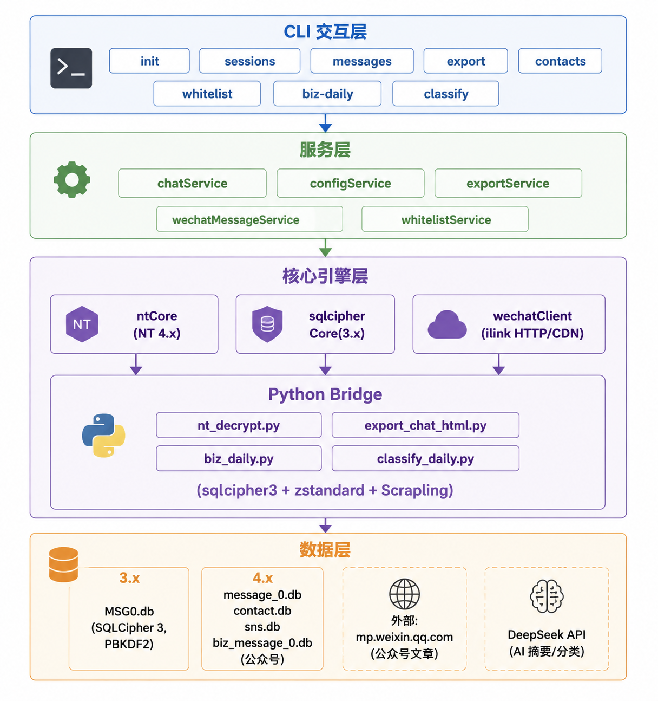

<div align="center">

# WeFlow CLI

*本地命令行工具，解密微信数据库导出聊天记录，抓取公众号文章并用 AI 整理为分类日报。*

> 飘飘乎如遗世独立，羽化而登仙

</div>

<br clear="all">

---

## ✨ v1.1.0 — 公众号日报 + AI 摘要

- ✨ **公众号日报** — 自动抓取今日推送全文，DeepSeek V4 生成摘要与主题分类
- ✨ **兴趣深度解析** — AI 相关文章自动生成深度分析（核心观点 + 关键细节 + 启示）
- ✨ **广告清洗** — 自动去除微信文章中的小说阅读器、悬浮提示等广告残留
- ✨ **按主题分文件夹** — AI / 学术 / 新闻 / 文学 四类独立目录，README 总索引
- ✨ **联系人昵称映射** — contact.db 交叉引用，sessions/contacts/messages 全面替换 wxid
- ✨ **CLI 兼容昵称** — 支持用昵称、备注名、序号代替 wxid
- 🔧 **命令行增强** — 新增 whitelist / login-wechat / send / listen 命令
- 🔧 **导出优化** — HTML 图片 base64 内嵌（NT 缓存提取），发送人识别为备注名

[完整变更记录 →](https://github.com/zhuobichen/weflow-cli/commits/master)

---

## Welcome

**WeFlow CLI** is a local CLI tool to decrypt WeChat databases, query/export chat records, fetch 公众号 articles, and organize them into categorized daily digests powered by AI — no GUI, no cloud upload, everything runs locally.

**WeFlow CLI** 是一个本地命令行工具，解密微信数据库、查询导出聊天记录、抓取公众号文章并用 AI 整理为分类日报。无需 GUI，不上传任何数据，纯本地运行。

---

## Feature

- **Chat Record Export** — 解密 3.x/4.x 加密数据库，导出 JSON / TXT / Markdown / HTML / Excel
- **AI Daily Digest** — 自动抓取今日公众号推送，DeepSeek 摘要 + 主题分类，按文件夹输出
- **Contact Name Mapping** — 自动从 contact.db 读取备注名/昵称，告别 wxid
- **HTML with Images** — 导出 HTML 含图片 base64 内嵌，微信风格气泡，发送人识别
- **Dual Version Support** — 兼容微信 3.x（传统路径）和 4.x（xwechat_files NT 路径）
- **Privacy First** — 密钥 AES-256-GCM 加密绑定单机，纯本地运行，零网络上传

---

## Quick Start

> 前置要求：Node.js 18+，微信已登录。NT 格式需 Python 依赖。

```bash
git clone https://github.com/zhuobichen/weflow-cli.git
cd weflow-cli
npm install && npm run build
npm run dev -- init
```

```bash
npm run dev -- sessions              # 查看聊天列表
npm run dev -- messages <昵称>       # 用昵称查消息
npm run dev -- export <昵称> html    # 导出 HTML
npm run dev -- whitelist add <昵称>  # 白名单管理
```

### 公众号日报

```bash
python scripts/biz_daily.py --api-key <DeepSeek-key>
python scripts/classify_daily.py --api-key <DeepSeek-key> --interest AI
```

> ⚠️ **NT 格式依赖**：`pip install sqlcipher3 zstandard scrapling html2text`
> ⚠️ **DeepSeek API key**：通过 `--api-key` 传入或设环境变量 `DEEPSEEK_API_KEY`

---

## Command Reference

| 命令 | 说明 |
|------|------|
| `npm run dev -- init` | 自动检测微信数据目录并提取密钥 |
| `npm run dev -- sessions` | 查看所有聊天会话（含昵称） |
| `npm run dev -- messages <昵称\|wxid\|序号>` | 查看聊天记录 |
| `npm run dev -- export <昵称> <json\|html\|txt\|excel>` | 导出聊天记录 |
| `npm run dev -- contacts [-k 关键词]` | 查看联系人列表 |
| `npm run dev -- whitelist add\|rm\|clear` | 白名单管理 |
| `npm run dev -- report --month <YYYY-MM> --talker <昵称>` | 生成聊天月报（AI 任务分析） |
| `python scripts/biz_daily.py --api-key <key>` | 生成今日公众号日报 |
| `python scripts/classify_daily.py --api-key <key>` | 后处理：广告清洗+分类+深度摘要 |

---

## Architecture



详见 [ARCHITECTURE.md](./ARCHITECTURE.md)

---

## 问题反馈

遇到 Bug 或有功能建议？欢迎通过以下渠道反馈：

- **[GitHub Issues](https://github.com/zhuobichen/weflow-cli/issues)** — 提交 Bug 报告 / 功能请求

提交 Issue 时建议附上：
- 使用的命令和参数
- 错误信息截图或日志
- 微信版本（3.x / 4.x）和操作系统

[GitHub Issues]: https://img.shields.io/badge/GitHub-Issues-orange?style=flat-square

---

## Thanks

- **[WeFlow](https://github.com/hicccc77/WeFlow)** — 原始桌面应用，本项目的设计灵感与原生库来源
- **[sqlcipher3](https://pypi.org/project/sqlcipher3/)** — Python SQLCipher 绑定，NT 数据库解密关键依赖
- **[DeepSeek](https://deepseek.com/)** — AI 摘要与主题分类引擎
- **[Scrapling](https://github.com/D4Vinci/Scrapling)** — Python 反反爬库，公众号文章抓取
- **[koffi](https://koffi.dev/)** — 高性能 Node.js FFI 库，微信进程内存密钥提取
- **[ExcelJS](https://github.com/exceljs/exceljs)** — Excel 导出引擎
- 感谢每一位使用和反馈的用户

---

## License

MIT License. See [LICENSE](./LICENSE) for details.

> 本工具仅供学习研究。请勿用于非法获取、泄露他人隐私信息等违反法律法规的行为。
